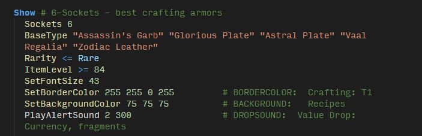

# poe-filter README

This is my first language definition for VS Code. It adds colors to `.filter` files if you rather edit the file directly, versus using [Filtration](https://github.com/ben-wallis/Filtration).

## How to Use

1. download a copy of the repository
1. navigate to `C:\Users\*YourUsername*\.vscode`
1. put the vscode-poe-filter-lang into the extensions folder.

## Known Issues

- Does not check for valid values, such as over 255

## Release Notes

See the [change log](CHANGELOG.md) for updates